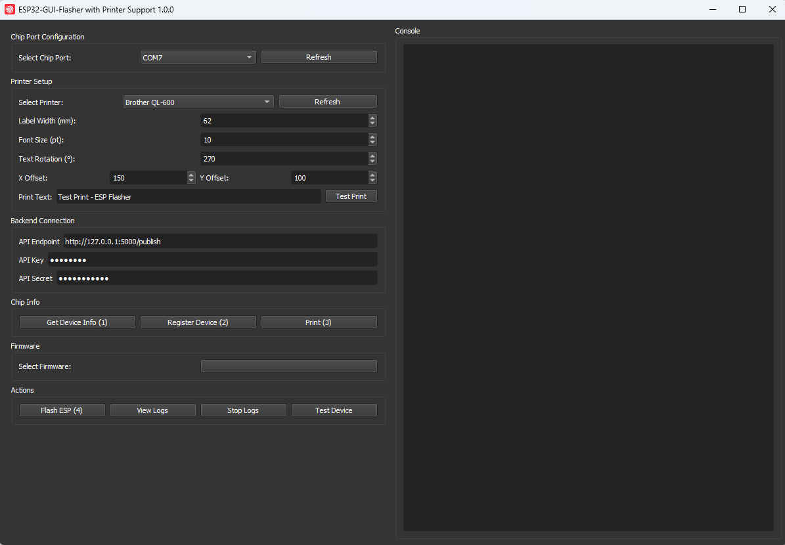

# ESP32 GUI Flasher – Easy Firmware Flashing with Label Printing

ESP32 GUI Flasher is a cross-platform tool that simplifies flashing firmware onto ESP32 devices and can optionally print device labels via a Brother QL-600 label printer. It provides an intuitive graphical interface to select your firmware package (as a single ZIP file) and handles all the esptool commands under the hood.
Non-essential options are hidden, making the process accessible for beginners while still offering advanced features like secure firmware flashing and device registration with an API. This README provides an overview of the project, setup instructions, a detailed guide on using the GUI, printer integration steps, and more.

**Table of Contents**

- [ESP32 GUI Flasher – Easy Firmware Flashing with Label Printing](#esp32-gui-flasher--easy-firmware-flashing-with-label-printing)
  - [Overview](#overview)
    - [Why use ESP32 GUI Flasher?](#why-use-esp32-gui-flasher)
  - [Features](#features)
  - [Installation and Setup](#installation-and-setup)
    - [Using the Pre-Built Binary (Windows)](#using-the-pre-built-binary-windows)
    - [Running from Source (All Platforms)](#running-from-source-all-platforms)
    - [Building a Standalone Executable (Not fully tested for Linux and MacOS)](#building-a-standalone-executable-not-fully-tested-for-linux-and-macos)
  - [Printer Integration (Brother QL-600)](#printer-integration-brother-ql-600)
    - [Supported Printer](#supported-printer)
    - [Windows Driver Setup](#windows-driver-setup)
    - [macOS Driver Setup (Untested)](#macos-driver-setup-untested)
    - [Linux Driver Setup (Untested)](#linux-driver-setup-untested)
    - [Label Printer Configuration in the GUI](#label-printer-configuration-in-the-gui)
  - [Using the ESP32 GUI Flasher](#using-the-esp32-gui-flasher)
    - [Selecting Firmware (ZIP Package)](#selecting-firmware-zip-package)
    - [Selecting the COM Port](#selecting-the-com-port)
    - [Backend Connection (API) Configuration](#backend-connection-api-configuration)
    - [Chip Info and Device Registration](#chip-info-and-device-registration)
    - [Flashing the ESP32](#flashing-the-esp32)
    - [Printing a Device Label](#printing-a-device-label)
  - [Configuration and Options](#configuration-and-options)
    - [Configuration File (`config.json`)](#configuration-file-configjson)
    - [Secure vs. Regular Firmware Flashing](#secure-vs-regular-firmware-flashing)
    - [Additional Options and CLI](#additional-options-and-cli)
  - [Contributing](#contributing)
  - [License](#license)
  - [Known Issues and Limitations](#known-issues-and-limitations)
  - [Contact \& Support](#contact--support)

## <a name="overview"></a>Overview

ESP32 GUI Flasher is designed to make firmware updates for ESP32-based hardware as simple as possible. Instead of dealing with command-line tools and multiple binary files, you can use a single unified GUI to perform the entire flash process. The tool uses Espressif’s official [esptool](https://github.com/espressif/esptool) utility under the hood, ensuring compatibility with all ESP32 boards and modules. In addition, it integrates with a label printer to print device information (such as a device name or ID) on a sticker immediately after flashing – useful for inventory management or deployment in the field.



### <a name="why-use-esp32-gui-flasher"></a>Why use ESP32 GUI Flasher?

* **All-in-One Firmware Package:**  We provide a script to create the firmware release as a `.zip` file containing all necessary binaries and a `flasher_args.json` (generated by ESP-IDF) – the tool parses this and automatically configures flash addresses and options. This means you don’t have to manually select bootloader, partition table, application `.bin`, etc.
* **Simplified Interface:** Non-essential settings are hidden or pre-set. The GUI only presents what you need to choose (firmware file and serial port), reducing the chance of mistakes.
* **Cross-Platform GUI:** Built with Python and PyQt5, it runs on Windows, Linux, and macOS (with some limitations on macOS printing). A Windows standalone `.exe` is provided for convenience.
* **Console Logging:** The tool displays flash progress and logs in a text console area so you can monitor the process in real-time.
* **Device Info & Registration:** It can retrieve the device’s chip info (like MAC address) and, if configured, register the device with a backend service using a provided API. This is useful for assigning or recording device IDs in an IoT deployment.
* **Label Printing:** Optionally connect a Brother QL-600 label printer to print a label for each device immediately after flashing, containing info like the device name or ID. This helps with physical labeling of devices. The printer integration is optional – the flasher works fine without a printer connected.

## <a name="features"></a>Features

Some of the core functionalities and benefits of ESP32 GUI Flasher include:

* **Pre-built Windows Binary:** Download and run without installing Python or any dependencies. (Linux/macOS users can run from source.)
* **Single Firmware File Input:** Accepts a zipped firmware release created by the script from ESP-IDF (with `flasher_args.json` and binaries) – no need to manually select multiple files.
* **Automatic Configuration:** Flash addresses, encryption settings, and other options are read from the firmware package and set automatically.
* **Secure Firmware Support:** Capable of flashing encrypted or secure-boot-enabled firmware just as easily as standard firmware (details in [Secure vs. Regular Firmware Flashing](#secure-vs-regular-firmware-flashing)).
* **Serial Port Detection:** Lists available serial ports (COM ports on Windows, `/dev/tty*` on Linux) for easy selection. A refresh button lets you detect newly plugged devices.
* **Cross-Platform Printing:** Integrates with the Brother QL series label printers (specifically tested on QL-600) for printing device labels. This uses the [`brother_ql`](https://pypi.org/project/brother-ql/) Python library to send print jobs directly to the printer (via USB or spooler).
* **Test Print Function:** Allows you to print a test label with custom text to verify printer settings (label alignment, offsets, etc.) before mass printing.
* **Device Registration Workflow:** Provides fields to input a REST API endpoint, API key, and secret. After flashing, you can fetch a device name or register the device in your system by clicking **Register**, then print a label with that name via **Print** – all within the tool.
* **Console Output & Logs:** A built-in console pane shows esptool output, success/error messages, and can stream device logs (after flashing, if you connect to serial logs).
* **MIT Licensed:** Completely open source ([MIT license](https://github.com/stevanStevic/esp32-gui-flasher/blob/main/LICENSE)) – you can modify and integrate it into your own workflow or contribute improvements.

## <a name="installation-and-setup"></a>Installation and Setup

You can either use the pre-built binary (available for Windows) or set up the Python code to run on your system. Both methods are outlined below. Developers who want to modify or extend the tool should follow the source setup instructions.

### <a name="using-the-pre-built-binary-windows"></a>Using the Pre-Built Binary (Windows)

For Windows users, a standalone executable is available in the [GitHub Releases section](https://github.com/stevanStevic/esp32-gui-flasher/releases):

1.  **Download the latest release:** Visit the Releases page of the repository and download the `ESP32-Flasher.exe` file (e.g., `ESP32-Flasher-v1.0.0.exe`). The release is packaged as a single file for convenience.
2.  **Modify the config file** After unzipping you can find the config file within at the same level as executable. You can modify it according to your needs.
3.  **Run the application:** Double-click the downloaded `.exe` to launch the GUI. There is no installation wizard; the app will open directly.
4.  **Optional:** If SmartScreen or your antivirus flags the app, it is a false positive due to the way PyInstaller bundles executables. You can allow the application to run. (For more details, see PyInstaller’s notes on antivirus false positives.)
5.  **Driver note:** Ensure you have the USB driver for your ESP32 board installed (if using a standard dev board, it’s usually a Silicon Labs or FTDI driver). This is not related to the flasher tool itself but required for Windows to recognize the serial port.

No additional dependencies are needed – all necessary libraries (PyQt5, esptool, etc.) are bundled in the executable.

### <a name="running-from-source-all-platforms"></a>Running from Source (All Platforms)

Running from source is supported on Windows, macOS, and Linux. You’ll need Python 3.7+ installed on your system. Follow these steps to set up the environment:

1.  **<a name="cloning-the-repository"></a>Clone the repository:** Download or clone the project from GitHub:

    ```bash
    git clone [https://github.com/stevanStevic/esp32-gui-flasher.git](https://github.com/stevanStevic/esp32-gui-flasher.git)
    cd esp32-gui-flasher
    ```

2.  **<a name="installing-python-and-pip"></a>Install Python 3 and pip:** Ensure Python 3 is installed and available in your PATH. On Windows, you can get it from the [Microsoft Store](https://www.microsoft.com/en-us/windows/python) or [python.org](https://www.python.org/downloads/). On macOS, you can use [Homebrew](https://brew.sh/) (`brew install python3`), and on Linux use your distro’s package manager (e.g., `sudo apt install python3 python3-pip` on Debian/Ubuntu, `sudo yum install python3 python3-pip` on Fedora/CentOS).

3.  **<a name="creating-a-virtual-environment-recommended"></a>Create a virtual environment (recommended):** This keeps the project dependencies isolated.

    ```bash
    python3 -m venv .venv
    source .venv/bin/activate    # On Linux/macOS
    .\.venv\Scripts\activate     # On Windows
    ```

4.  **<a name="installing-requirements"></a>Install requirements:** The project has multiple requirement files for different purposes. For development usage, install the main requirements:

    ```bash
    pip install -r requirements.txt
    ```

    This will install PyQt5, esptool, brother-ql, and other needed libraries. (Windows users should also install pywin32 which is included in `requirements_win.txt`; see next section if you encounter issues.)

5.  **<a name="launching-the-gui"></a>Launch the GUI:** After installation, start the application by running:

    ```bash
    python -m esp_flasher
    ```

    This will open the ESP32 GUI Flasher window. Alternatively, on Linux/macOS you might directly call the entry script, but using `python -m esp_flasher` ensures the module is loaded correctly.

6.  **<a name="optional-command-line-usage"></a>(Optional) Command-line usage:** The tool also provides a CLI interface. You can see options by running:

    ```bash
    esp_flasher -h
    ```

    in the environment. This isn’t required for normal GUI use, but advanced users could script the flashing process using this.

### <a name="building-a-standalone-executable"></a>Building a Standalone Executable (Not fully tested for Linux and MacOS)

If you want to build a one-file executable from the source (for distribution or convenience), you can use PyInstaller. The repository provides a brief guide in `build-instructions.md`. 

**MacOS Build:**

While not explicitly documented, you can attempt to use PyInstaller on macOS as well. The process would be similar to Linux. Note that PyInstaller on macOS will create an `.app` bundle or executable. You may need to provide a `.icns` icon (or use `icon.png` as a generic icon). macOS support for PyInstaller exists, but printing functionality in this tool is not natively supported on Mac (see [Known Issues and Limitations](#known-issues-and-limitations)). For flashing functionality, the built app should work.

After building, you can distribute the resulting binary. Remember that on Linux/macOS, the user may need to mark the file as executable (`chmod +x ESP32-Flasher`) before running it.

## <a name="printer-integration-brother-ql-600"></a>Printer Integration (Brother QL-600)

One standout feature of this flasher is the ability to print labels for flashed devices using a Brother QL-600 label printer. This integration is optional – you can flash firmware without ever connecting a printer. But if you do use it, here’s how to set up the printer on each platform and configure it in the app.

### <a name="supported-printer"></a>Supported Printer

The tool is built and tested for **Brother QL-600** (also referred to as QL-600B model). Other Brother label printers *may* work if they are supported by the underlying [`brother_ql`](https://pypi.org/project/brother-ql/) library, but QL-600 is the primary target. Ensure you have the QL-600 printer and appropriate label rolls (it supports up to 62mm width DK labels, including continuous tape and pre-sized labels).

### <a name="windows-driver-setup"></a>Windows Driver Setup

On Windows, install the official Brother QL-600 driver so that the printer is recognized by the system. You can download the latest drivers from [Brother’s support page](https://support.brother.com/g/b/downloadlist.aspx?c=us&lang=en&os=10013&dcm=whg&s=d&mdl=QL600):

1.  **Download Driver:** Go to Brother’s QL-600 Downloads page (US). Select Windows as the OS and download the **Printer Driver** or the full **Driver & Software** package.
2.  **Install:** Run the downloaded installer and follow the prompts. This will install the USB driver and the P-touch Editor software (optional). After installation, connect the QL-600 via USB if not already connected.
3.  **Verify Printer in Windows:** Ensure the QL-600 appears in **Devices and Printers**. It should show up as a printer (e.g., “Brother QL-600”). If it’s listed and can print a test page from Windows, it’s ready to be used in the flasher tool.
4.  **Editor Lite Mode:** The QL-600 may support an “Editor Lite” mode (where the printer acts as a USB drive for drag-and-drop label printing). Disable Editor Lite by holding the printer’s button until the LED is off, if it’s enabled. This allows the PC to directly control the printer ([pypi.org](https://pypi.org/project/brother-ql/)) (for most users this isn’t an issue, but it’s good to know).

In the ESP32 GUI Flasher, when you go to **Printer Setup**, click **Refresh** and you should see your printer in the drop-down (it reads installed printers via Windows API). Select “Brother QL-600” from the list.

### <a name="macos-driver-setup"></a>macOS Driver Setup (Untested)

On macOS, install the Brother QL-600 driver and CUPS support:

1.  **Download Driver:** Visit [Brother’s QL-600 support page](https://support.brother.com/g/b/downloadlist.aspx?c=us&lang=en&os=10004&dcm=whg&s=d&mdl=QL600) and select Mac as the OS (drivers are available for macOS 10.12 through macOS 15 as of this writing). Download the **Brother Printer Driver for QL-600**.
2.  **Install:** Run the installer package (`.pkg`) and follow instructions to install the printer drivers.
3.  **Add Printer:** After installation, go to **System Preferences > Printers & Scanners**, click the **+** button to add a new printer. The QL-600 should be detected via USB. Add it, using the Brother driver provided (it might show up as “Brother QL-600” with Driver “Brother QL-600 CUPS” or similar).
4.  **Test:** Print a test label via Brother’s P-touch Editor or macOS to ensure the printer works.

**Note:** The current version of ESP32 GUI Flasher does not automatically detect printers on macOS (auto-detection is implemented for Windows and Linux only),. This means the printer list in the GUI might appear empty on Mac. As a workaround, you can still use the printing feature by entering a printer identifier manually in the code or ensuring a CUPS queue name. This is an advanced use case – out of the box, printing from the tool on macOS might not function. You can still use the flasher for its main purpose (flashing firmware) on macOS; consider printing labels outside the tool until macOS support improves.

### <a name="linux-driver-setup"></a>Linux Driver Setup (Untested)

On Linux, the QL-600 can be set up via CUPS:

1.  **Drivers:** Brother provides Linux drivers in `deb` and `rpm` format on their site ([support.brother.com](https://support.brother.com/g/b/downloadlist.aspx?c=us&lang=en&os=128&dcm=whg&s=d&mdl=QL600)). Download the appropriate package (Debian/Ubuntu users: `.deb` packages; Fedora/RedHat: `.rpm` packages; Raspberry Pi OS is also supported with a Raspbian package).
2.  **Install the driver:** For example, on Ubuntu/Debian:
    ```bash
    sudo dpkg -i ql600lpr.deb
    # and possibly a cupswrapper deb
    ```
    These drivers install a CUPS wrapper for the printer.
3.  **Add via CUPS:** Ensure CUPS is installed and running (`sudo apt install cups` if not). Open the CUPS web interface at `http://localhost:631` and add the Brother QL-600. You may also use your OS’s printer settings UI to add it.
4.  **Permissions:** Make sure your user is in the `lp` or `lpadmin` group if required, so you can access the printer.
5.  **Test Print:** Try printing a test from CUPS or the command line (for example, using `lpr`) to verify the setup.

In the ESP32 GUI Flasher’s Printer drop-down on Linux, click **Refresh**. The tool will call `lpstat -p` to list printers. You should see your printer’s queue name in the list if CUPS is configured (e.g., it might list “QL600” or whatever name you gave it). Select that. The printing backend will use the CUPS system to send the label job.

### <a name="label-printer-configuration-in-the-gui"></a>Label Printer Configuration in the GUI

Once your printer is set up on the OS and selected in the flasher tool, you have a few options to configure how the label will be printed:

* **<a name="selecting-printer"></a>Select Printer:** In the **Printer Setup** section of the GUI, use the drop-down to choose your QL-600 printer. On Windows, this will show the printer name (from the system). On Linux, it shows the CUPS queue name. After selecting, the tool stores the choice internally.
* **<a name="label-width-mm"></a>Label Width (mm):** Set the width of the label roll you are using. Default is `62` mm, which corresponds to the standard continuous tape width for QL-600. If you use a narrower tape (like 29mm), adjust this value. It affects how the print image is formatted (the software will use this width to scale the content).
* **<a name="font-size-pt"></a>Font Size (pt):** The size of the text printed on the label. Default is `20` pt, which produces reasonably large text for a device name. You can increase this for bigger text or decrease for more content.
* **<a name="text-rotation-"></a>Text Rotation (°):** Rotation of the printed text. Default is `270`° (degrees), which prints the text rotated (for QL printers, 270° rotation will print text along the label if using continuous tape). You can set 0, 90, 180, or 270. Typically, 270° is used to print the text in a orientation that reads correctly when the label is peeled off (for standard landscape labels).
* **<a name="x-offset--y-offset"></a>X Offset / Y Offset:** These are offsets (in printer dots/pixels) to adjust the text position on the label. Defaults are `100` for both X and Y,. If you notice text is too close to one edge, you can tweak these. For example, increasing Y Offset might add more top margin. This can require a bit of trial and error depending on the label type.
* **<a name="test-print"></a>Test Print:** There is a **Print Text** field and a **Test Print** button in the **Printer Setup** section. You can enter any text in “Print Text” (by default “Test Print - ESP Flasher” is provided) and press **Test Print** to print a label immediately with those settings. This is very useful to verify alignment, density, and that the printer is working. When you click **Test Print**, the tool will generate a print job with your current settings (width, font, rotation, offsets) and send it to the printer,. You’ll get a success or error message in the console (and a physical label if successful).

Keep in mind that label printing in this tool is primarily designed for printing simple text (like a device name or ID). It doesn’t currently support advanced layouts or images on the label via the GUI. If you need a QR code or logo, you would have to extend the code (the `brother_ql` library supports printing images).

## <a name="using-the-esp32-gui-flasher"></a>Using the ESP32 GUI Flasher

When you launch the ESP32 GUI Flasher, you will see the main window divided into sections for Firmware, Chip Port, Backend Connection, Printer Setup, Chip Info, and an action button to flash. There’s also a console output area at the bottom that shows logs and messages.

Here we’ll describe each field/control and how to use it, as well as the general workflow for flashing and printing.

### <a name="selecting-firmware-zip-package"></a>Selecting Firmware (ZIP Package)

The first step is to select your firmware file. In the top section labeled **Firmware**, click the **Browse** button. A file dialog will open, filtered to show `.zip` files. Navigate to your firmware release zip and select it.

You can package the release ZIP with [this script](./scripts/create_release.py). You shall run this script within your project repository after building it with your preferences, even including secure and encrypted build.

**What should the ZIP contain?** It should be a package generated by ESP-IDF’s build system (or equivalent), containing:

* `flasher_args.json` – a JSON file with flash addresses and file names. The tool uses this to know what to flash where.
* The binaries to flash, for example: `bootloader.bin`, `partition-table.bin`, `app.bin` (your main firmware), and any other binaries (e.g., `ota_data_initial.bin`, SPIFFS image, etc. if applicable).
* Optionally, encryption keys or other files if needed by your process, though typically not – the `flasher_args` will reference everything needed.


When you select the zip, the GUI’s firmware button text will change to the filename, indicating it’s loaded. Internally, the tool reads the `flasher_args.json` from the ZIP. All required fields for flashing (addresses, etc.) are now set in memory. You do not need to specify anything else about the firmware.

If you selected a zip that does not contain the expected files, the flashing process may fail. Always use the exact output zip from your firmware build. (In ESP-IDF you can create this by running `idf.py archive-flash` or manually zipping the build directory’s flasher files.)

### <a name="selecting-the-com-port"></a>Selecting the COM Port

Next, ensure your ESP32 device is connected via USB. In the **Chip Port Configuration** section, there is a drop-down to select the serial port and a **Refresh** button,.

* On Windows, the drop-down will show COM ports (e.g., COM3, COM4, etc.).
* On Linux/macOS, it will show device paths (e.g., `/dev/ttyUSB0`, `/dev/tty.SLAB_USBtoUART`, etc.).

Upon launching, the tool automatically populates this list with available ports. If you plugged in your device after launching the app or if it wasn’t in bootloader mode initially, click **Refresh** to update the list.

Select the port that corresponds to your ESP32 board. If you’re unsure, on Windows check Device Manager’s COM ports section; on Linux/macOS you can check `dmesg` or use `ls /dev/tty*` before and after plugging in to see which new port appeared.

Once you choose the port, the tool will store it internally (`_chip_port`) for use during flashing.

* **Bootloader Mode:** Most ESP32 development boards can reset into bootloader mode automatically via the DTR/RTS signals when the flasher opens the port. If you have an ESP32 module without auto-reset, you may need to hold the **BOOT** button (and reset the device) to enter programming mode when you start flashing. The tool itself just invokes `esptool`, which will try the reset sequence – so in most cases you don’t need to do anything special.

### <a name="backend-connection-api-configuration"></a>Backend Connection (API) Configuration

This section is labeled **Backend Connection** in the GUI. It contains three fields:

* **API Endpoint** – the base URL of your device registration service (e.g., `https://api.example.com/devices`).
* **API Key** – an identifier for authentication (e.g., a username or key ID).
* **API Secret** – a secret or token used along with the key for authentication.

These fields are optional. They are provided for use in environments where you want the flasher to register the device in a database or cloud system after flashing. For example, you might have a web service that, given a device’s MAC address, returns a unique name or stores that the device has been deployed.

If you intend to use the **Register** feature (described below), fill these in:

* Enter the full URL or endpoint of your API.
* Enter the credentials (or token) required.

The API Key/Secret fields are masked (they won’t show the text as you type, for security). The values you enter here get saved to a config file so you don’t have to re-enter each time (discussed in [Configuration File](#configuration-file-configjson)).

If you are not using any backend service, you can leave these fields blank. The **Register** and **Print** buttons in **Chip Info** section will then prompt you to fill these if you click them, but if you’re not using them, it won’t affect the flashing process at all.

### <a name="chip-info-and-device-registration"></a>Chip Info and Device Registration

The **Chip Info** section contains three buttons: **Get Device Info**, **Register**, and **Print** (not to be confused with the **Test Print** in the **Printer** section).

* **<a name="get-device-info"></a>Get Device Info:** This button will retrieve information from the connected ESP32. Specifically, it runs a command to get the unique MAC address of the ESP32 (and possibly other chip data). When you click this, ensure a port is selected and the device is connected/powered. The tool will clear the console and start a background thread to read the chip info. After a moment, you should see the ESP32 MAC address (and other details) printed in the console or a success message. Internally, the MAC address is stored in the tool,. If no port was selected, you’ll get an error prompt “Device port is missing!”,.

    This step is mainly needed if you plan to register/label the device. It’s not strictly required just to flash firmware. However, it’s a good idea to do it because the MAC address can confirm that the tool is communicating with the chip properly. It uses `esptool`’s features to read efuse info for MAC.

* **<a name="register"></a>Register:** This button will attempt to register the device in your backend system using the API details you provided. When clicked, it checks that API Endpoint/Key/Secret are all provided and that a MAC address has been obtained (you ran **Get Device Info** first). If any of those are missing, it will show an error (e.g., “API endpoint and/or credentials are missing” or “No MAC address found! Click 'Get Device Info' first.”). Assuming all is set, the tool will start a background `RegisterThread` to call your API. The exact behavior depends on your API – you would likely customize this part of the code to fit your service. In general, the thread would send the MAC (and possibly other info) to the API and expect a device name or confirmation in response.

    If successful, the `RegisterThread` should emit a `device_name_signal` which the GUI handles to store the device name and display a message “Device Registered: \[name]”,. Now the tool knows the friendly name of the device.

    If you are not using an API, you can ignore the **Register** button. Alternatively, you could repurpose it: for instance, configure a dummy endpoint that just returns a standardized name or use it in offline mode. But typically, skip if not needed.

* **<a name="print-device-label"></a>Print (Device Label):** This **Print** button in **Chip Info** is used to print a label for the device after registration. It assumes you have:

    * Selected a printer (Printer Setup done),
    * Obtained a device name via **Register**,
    * Or alternatively, you manually set the "Print Text" and use **Test Print** button (if you’re not using the API, the tool doesn’t know what text to print on the label via this button).

    When you click **Print**, it will check that a printer is selected and a device name is available,. If not, you get an error (e.g., “No printer port selected!” or “Device name not obtained, first Register the device.”),. If all is well, it gathers the current printer settings (width, rotation, offsets, font) from the **Printer Setup** section and starts a print job (similar to the **Test Print**, but using the stored device name as the text),. This runs in a thread and will show a success or error message accordingly (usually “Print job sent successfully.” on success).

    Essentially, this is the one-click final step to label your device with the assigned name after flashing and registering. If you didn’t use the **Register** feature, you can’t use this button to print a name (since no `_device_name` exists). In that case, use the **Test Print** in **Printer Setup** to print a custom text label – for example, you could manually type the device’s MAC or any identifier in the text field and print it.

### <a name="flashing-the-esp32"></a>Flashing the ESP32

With firmware selected and the serial port chosen, you’re ready to flash:

* Click the **Flash ESP** button (sometimes labeled just “Flash” or “Flash ESP32” depending on the version). The tool will respond by first ensuring no flash operation is already running (to avoid duplicates). Then it will print “Starting flashing process...” in the console.
* The flashing runs in a background thread to keep the GUI responsive. You’ll see output similar to `esptool`’s logs in the console area. This includes messages like connecting, erasing flash (if applicable), writing each segment, and the progress percentages. All the necessary addresses and files are fed to `esptool` according to the `flasher_args.json` – you don’t have to worry about any offsets.
* **Do not disconnect power or reset the board during this process.** It typically takes a few seconds to a minute, depending on the size of your firmware and the baud rate used (the tool by default uses a high baud rate like 460800 or 921600 for ESP32).
* On completion, you will see a success message or an error:
    * If successful, the console might show something like “Hash of data verified” and the GUI will emit a success signal leading to a message box “Flashing complete” (the exact wording may vary). The Flash button thread then stops.
    * If there’s an error (e.g., unable to connect, or a file not found), an error message will be shown. Common issues could be wrong port, device not in bootloader mode, or incorrect firmware package format.
* After a successful flash, the ESP32 will reset and boot into the new firmware.

If the firmware you flashed starts sending logs to UART, you can click a **View Logs** button to begin a log thread that prints serial output to the console in real-time. This is helpful to verify the firmware is running as expected. The log thread can be stopped as well. (This functionality is similar to running `idf.py monitor` or `esptool.py --monitor`). If your version of the tool has the **ViewLogs** button, use it after flashing to see device output.

### <a name="printing-a-device-label-1"></a>Printing a Device Label

This step is optional and only applicable if you have the printer connected and want to print labels:

If you followed the earlier sections:

* You got the MAC address via **Get Device Info**.
* You clicked **Register** and the tool acquired a Device Name (for example, “Device-42”) from your system.
* You have the Printer selected and configured.

Now simply click **Print** in the **Chip Info** section. The label should print out with the device’s name.

If you are not using the **Register** feature but still want to print a label:

* Enter the text you want in the **Print Text** field under **Printer Setup**.
* Click **Test Print** which effectively prints that text with the current settings.

In either case, attach the printed label to your device. You now have a physically labeled ESP32 device corresponding to the firmware you just flashed.

This workflow is especially useful when flashing many devices in sequence: you can flash, get info, register, print, and move to the next device, knowing each one is labeled and recorded.

## <a name="configuration-and-options"></a>Configuration and Options

The ESP32 GUI Flasher provides a few configuration mechanisms and behaviors to be aware of:

### <a name="configuration-file-configjson"></a>Configuration File (`config.json`)

The application automatically saves certain settings to a JSON file (`config/config.json`) in the project directory. Specifically, the API Endpoint, API Key, and API Secret you enter in the **Backend Connection** fields are persisted. This way, you don’t have to re-enter your API credentials every time you run the tool. They are loaded on startup and populated in the fields.

The config file may also store other state in future (such as last used COM port, etc.), but primarily it’s for the backend settings. The file is in plain JSON – if needed, you can edit or clear it manually (especially if you entered wrong credentials and want to reset).

Example snippet of `config.json`:

```json
{
    "api_endpoint": "[https://api.mycompany.com/device/register](https://api.mycompany.com/device/register)",
    "api_key": "user123",
    "api_secret": "ABCD1234EF567890..."
}
```

This file is created/updated when you exit the application (or when you change the text fields). Security note: The API secret is stored in plain text in this file. Ensure your system is secure, or consider using a token with limited scope.

### <a name="secure-vs-regular-firmware-flashing"></a>Secure vs. Regular Firmware Flashing

Flashing a secure/encrypted firmware with this tool is as straightforward as flashing a regular firmware – the process is almost the same from the user’s perspective. However, it’s important to understand what secure flashing entails:

* **Regular Firmware:** This is the standard case – your firmware is not encrypted and the bootloader is standard. The `flasher_args.json` will contain entries for bootloader, partition table, app, etc., with their addresses (e.g., bootloader at 0x1000, partition table at 0x8000, app at 0x10000 which are standard for ESP32).
* **Secure Boot / Flash Encryption Firmware:** If your project is configured for secure boot (signature verification) or flash encryption, the binaries you flash might be encrypted or signed. Typically, ESP-IDF will produce a `flasher_args.json` as well, but in some cases (e.g., secure boot v2), certain entries might be missing or handled differently (Espressif’s tooling sometimes expects you to flash the bootloader separately in secure cases).
    * If `flasher_args.json` is complete, the tool will flash everything it lists. It’s your responsibility to use the script or ensure those binaries are prepared (signed bootloader, encrypted app if needed).
    * The ESP32 ROM bootloader will handle the decryption if flash encryption is enabled in Development mode. So you can still flash an unencrypted image to an encrypted device and it will encrypt on the fly. If the device is in Production (no plaintext accepted) mode, you must flash an already-encrypted image. The tool does not itself perform encryption; it just writes whatever is in the zip.
    * For secure boot, after flashing, the device will only boot if the images are correctly signed and the secure boot is provisioned.

Using the tool in secure scenarios:

* Build your firmware with secure options on in ESP-IDF. After build, get the flasher zip (it may exclude the bootloader if ESP-IDF expects you to flash bootloader separately – if so, you might need to manually include it in the zip).
* Use the GUI flasher as normal to flash. If the bootloader wasn’t included (and your device has a factory-provisioned bootloader), that’s fine – the device’s existing bootloader remains. If you need to flash a new bootloader, ensure it’s signed and include it.
* The tool doesn’t have a special “secure mode” toggle – it relies on the firmware package. So double-check that package. If something is missing, you can add it and even adjust the `flasher_args.json` accordingly (advanced).
* After flashing, secure boot devices often require a reset to finalize the process (the tool usually resets the chip anyway).

From a user perspective, you don’t have to do anything differently in the GUI. The differences are all in how the firmware is built. The GUI will hide or show the same fields regardless – it’s always a zip file input. As long as that zip was prepared for secure flashing, the tool will flash it correctly.

One thing to note: if you plan to re-use the Register/Print features in a production environment, secure firmware often means each device has unique keys or certificates. You might want to use the Register step to upload those to your database.

### <a name="additional-options-and-cli"></a>Additional Options and CLI

* **Erasing Flash:** The tool doesn’t explicitly have an “Erase flash” button, but if you ever need to wipe the device, you could use the CLI (`esp_flasher` command with an erase option if available, or use `esptool` separately). In normal cases, flashing new firmware will overwrite the necessary regions, and unused regions (like NVS or SPIFFS) remain intact.
* **Multiple Device Support:** Currently, the GUI is designed for one device at a time. If you have multiple ESP32s connected, they will all show in the port list – ensure you select the correct one. You would run multiple instances of the app if you wanted to flash in parallel (or use the CLI in parallel scripts).
* **ESP32 vs ESP8266:** The name suggests ESP32, but the underlying `esptool` can also flash ESP8266. This tool hasn’t been explicitly documented for ESP8266, but if you provide an ESP8266 firmware zip with appropriate args, it **might** work. Keep in mind the label printing and register workflow are generic and could apply to any device, not just ESP32.
* **Updating the Tool:** Since it’s open source, you can pull the latest changes or contribute. If you update the source, just reinstall the requirements if needed and run again.

## <a name="contributing"></a>Contributing

Contributions to ESP32 GUI Flasher are welcome! If you have ideas for new features (for example, support for more printers, better macOS support, or general improvements), feel free to open an issue or submit a pull request.

To contribute:

* Check for open issues: Someone might have reported the issue or requested the feature you’re interested in. Comment or add insights there.
* Fork the repository: Make your changes in a new branch.
* Ensure compatibility: Try to keep the tool working on all platforms (Windows, Linux, macOS). If adding a dependency, consider its impact on PyInstaller packaging.
* Coding Guidelines: This project is Python-based. Follow standard Python style (PEP8). The GUI uses PyQt5; maintain the pattern of separating logic into threads to keep the UI responsive.
* Testing: If possible, test your changes with actual hardware. For example, if you modify printer code, test by printing a label. If you change flashing logic, flash an ESP32. At minimum, ensure the app launches without errors.
* Pull Request: Submit a PR with a clear description of the problem and solution. The maintainers will review it.

By contributing, you agree that your code will be released under the MIT License.

## <a name="license"></a>License

This project is licensed under the **MIT License. You are free to use, modify, and distribute the software. See the [LICENSE](https://github.com/stevanStevic/esp32-gui-flasher/blob/main/LICENSE) file for details. This permissive license means you can integrate this tool or its code into your own projects (even commercial ones), though providing attribution is appreciated.

## <a name="known-issues-and-limitations"></a>Known Issues and Limitations

While ESP32 GUI Flasher aims to be robust, there are some known issues and areas to note:

* **Antivirus False Positives (Windows):** As mentioned, the Windows exe might be flagged by some antivirus programs due to the PyInstaller packaging. This is a known issue with many PyInstaller-based apps. You may need to whitelist the application.
* **Single Printer Model Support:** The integration is tailored to Brother QL-600. Other Brother QL models (e.g., QL-700, QL-800 series) might work with minor tweaks (changing the model string in code to match, etc.). The `brother_ql` library supports many models \([pypi.org](https://pypi.org/project/brother-ql/)\), but the code explicitly uses "QL-600B" model identifier. If you use a different model, you’d have to adjust this. Similarly, only the standard 62mm label width is considered by default.
* **No GUI progress bar:** The tool shows text logs during flashing but doesn’t have a graphical progress bar for the flashing operation. Watch the console output for progress (it will show the percentage from `esptool`).
* **No explicit support for multiple files outside zip:** You must use a zip with `flasher_args.json`. You cannot currently point to individual binaries in the GUI. This is by design (to simplify usage). If you don’t have a `flasher_args.json`, you could create one or flash via `esptool` CLI.
* **Register feature assumptions:** The **Register** button’s functionality is generic – you might need to customize the `RegisterThread` (in code) to fit your API. The current implementation expects a certain JSON response to get `device_name`. If using out-of-the-box, ensure your API returns a simple string or adjust accordingly. This is more of a feature note than an issue.
* **Platform-specific UI quirks:** On Linux, you must have an X11 display to run (as with any Qt app). On headless servers, use X forwarding or a virtual display if needed. On Windows, the app icon may not show in the taskbar (minor PyQt issue). These do not affect functionality.
* **ESP32 Reset after flash:** In some rare cases, an ESP32 might not automatically reset after flashing (especially if auto-reset lines aren’t connected). You may need to manually press the reset button. Usually, the tool toggles DTR/RTS to reset it.
* **Large Labels / Text Wrapping:** The tool does not handle multi-line labels or text wrapping. If your device name is very long, it might get cut off or printed on one line beyond the label. You might mitigate by reducing font size or manually editing the text to include newline (`\n`) if needed (not officially supported, but the library might print it on multiple lines if newline is present).

Future updates and contributions may solve some of the above. Check the GitHub issues for progress or to report new issues.

## <a name="contact--support"></a>Contact & Support

For support, you can use the following channels:

* **GitHub Issues:** If you encounter a bug or have a feature request, please open an issue on the GitHub repository. This is the preferred way for support, as it allows others to see and contribute to the discussion.
* **GitHub Discussions:** (If enabled in the repo) for Q&A and usage tips from the community.
* **Email:** You may contact the maintainer (Stevan Stevic) if needed. (Check the Git commit logs or GitHub profile for an email if provided. As of writing, direct contact is primarily through GitHub.)
* **Community Forums:** For general ESP32 questions (not specific to this tool), the Espressif Forum or r/esp32 on Reddit are good resources. If asking about this tool, mention “ESP32 GUI Flasher by stevanStevic” so others know what you’re referring to.

We hope this tool makes your firmware deployment easier and more organized. Happy flashing and printing!